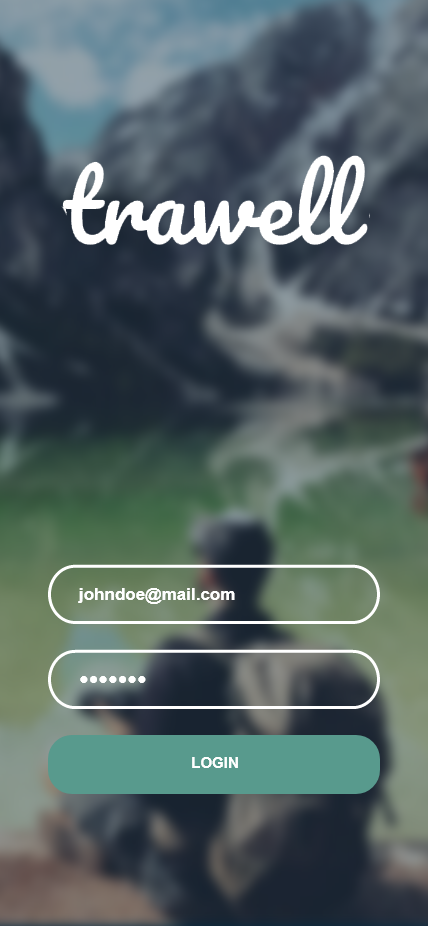

## PROJECT
  

## INSTALLATION

BACKEND:

`python -m venv .venv`
`source .venv/bin/activate`
`pip3 install -r requirements.txt`
`python app.py`

FRONTEND:

E.g. you can run frontend/index.html with LiveServer plugin.

## LICENSE

This project had been developed for CASSINI hackathon.